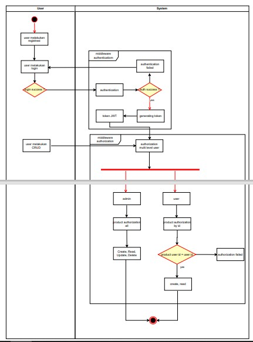

# Challnges 12-13

## Flow project

## KET :

Rest API product (create, read, update, delete)
dengan fitur login dan register, serta memiliki 3 fitur
middleware antara lain :

- Authentication
- Authorization multi level user
- Authorization access product by id
- Authentication with JWT token

## Endpoint :

1. User

- /register =>[POST] for register
- /login =>[POST] for login

2. Product

- user/product =>[GET] for GETAll Product
- user/product/:id =>[GET] for GET product with id
- user/product =>[POST] for add product
- user/product/:id =>[PUT] for Update product with id
- user/product/:id =>[DELETE] for delete product with id
